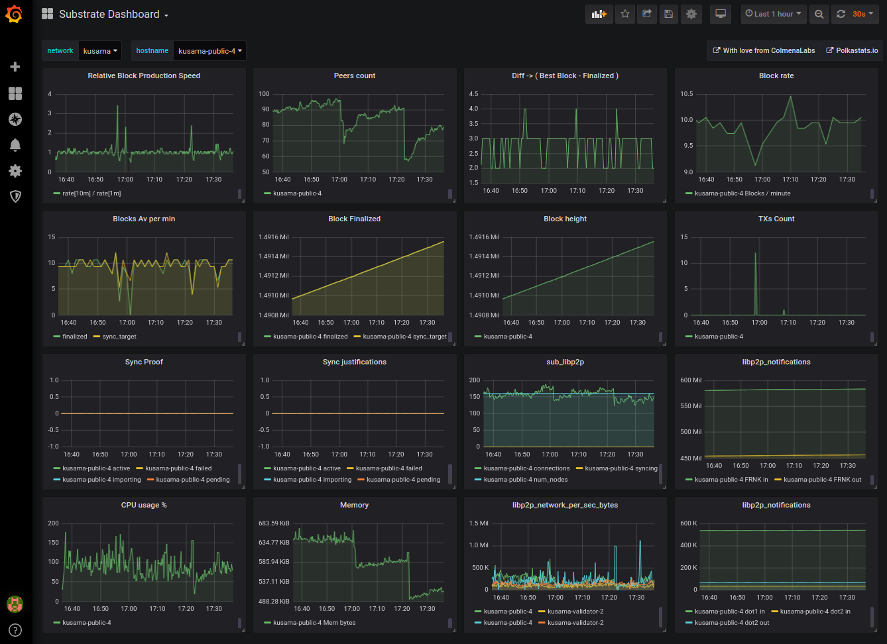
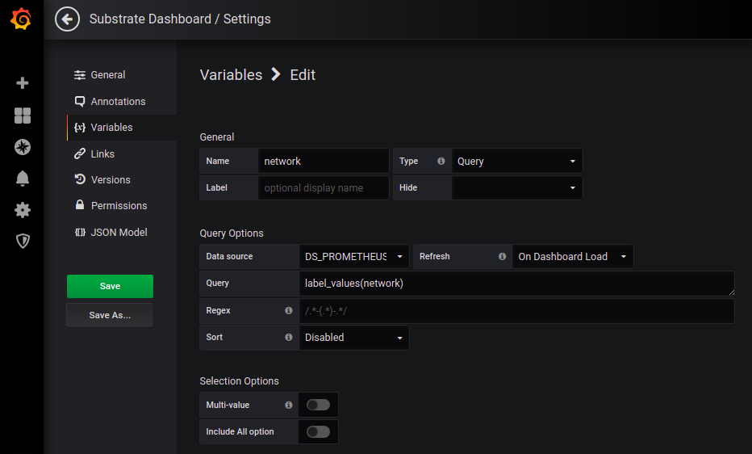
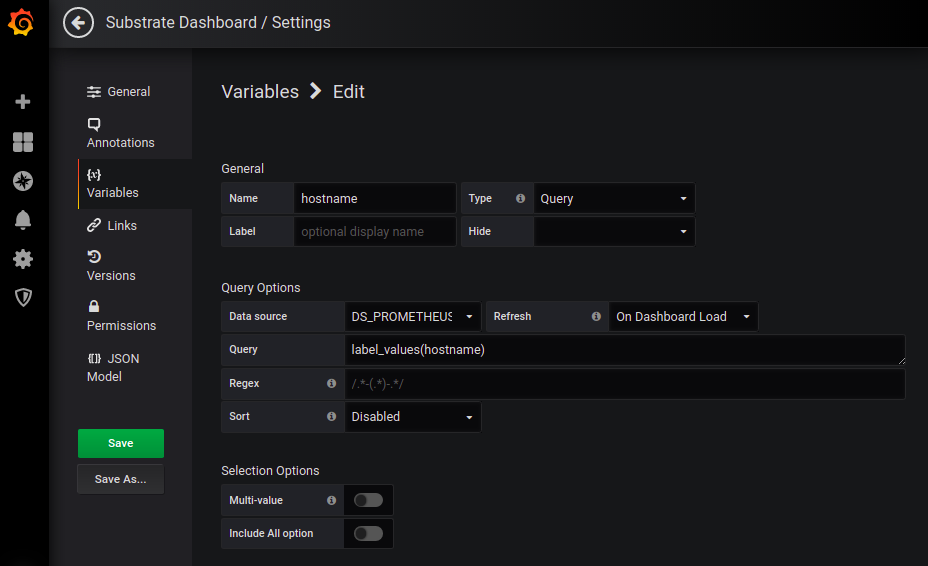

## Substrate Dashboard



### Usage

This json is intended to be copy/pasted this way:

1. Create a new Dashboard in your grafana
2. Go to configuration ( gear at top right bar )
3. Go to JSON Model ( last option of left menu )
4. Overwrite the content of the current JSON Model with [THIS json](substrate-dashboard.json)

### Prometheus job template

This Dashboard uses a couple of job labels that you should add to your
prometheus.yml config file. It is also important that you follow the
same job name patern. What follows is an example of prometheus job
suitable for using this grafana dashboard

```
  - job_name: 'polkadot_kusama-public-4'
    static_configs:
    - targets: ['123.123.123:9615']
      labels:
        network: 'kusama'
        hostname: 'kusama-public-4'
```

- Notice that job name follows this rule: polkadot__[hostname]
- Notice the 2 needed labels **network** and **hostname**

### Grafana variables setup

This Dashboard uses 2 grafana variables. They will allow you to monitor in the same panel diferent networks and nodes.


#### Variable definitions:

$network

                                                                                                                                            

$hostname

                                                                                                                                            

